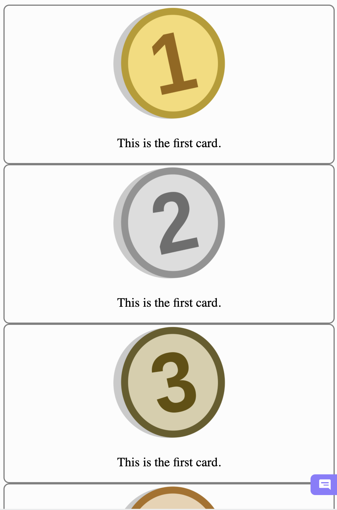
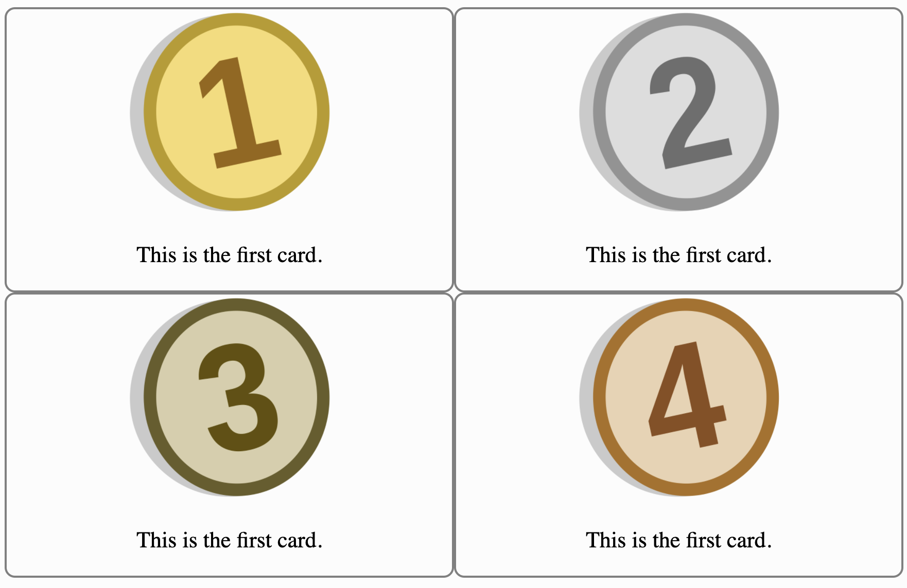
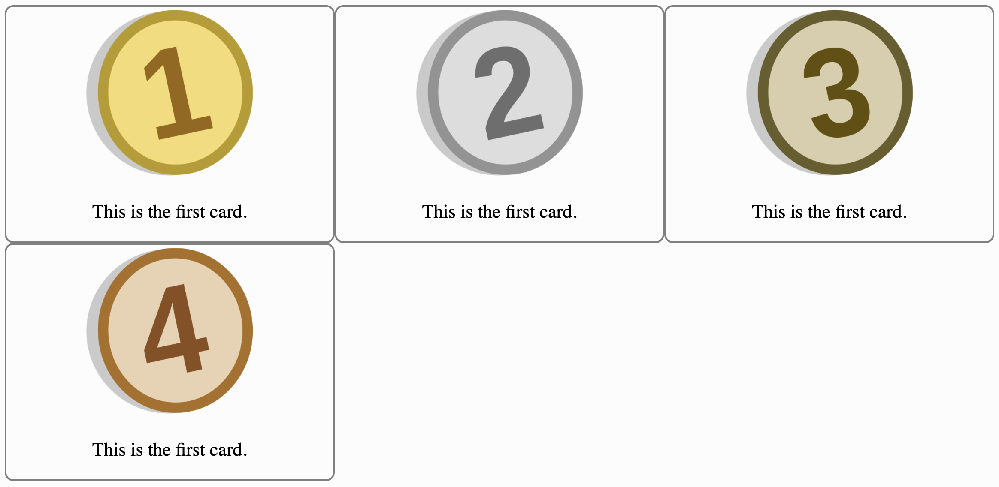
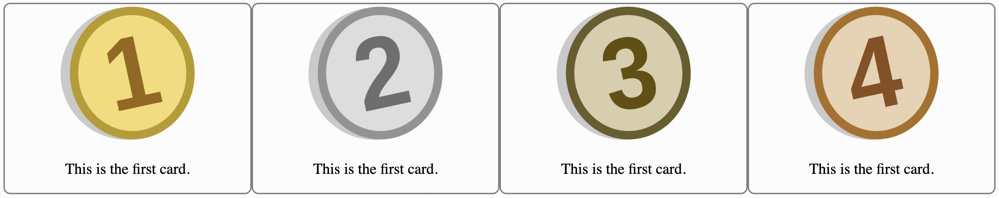

# Instructions  

---

Use `auto-fill` and `minmax` to make these cards align in a grid.
When there's not enough space, all four cards should have their
own row like this:

When the window expands, there should be two cards on each
row like this:

When the window gets even larger:

Finally, at the largest window
width:

